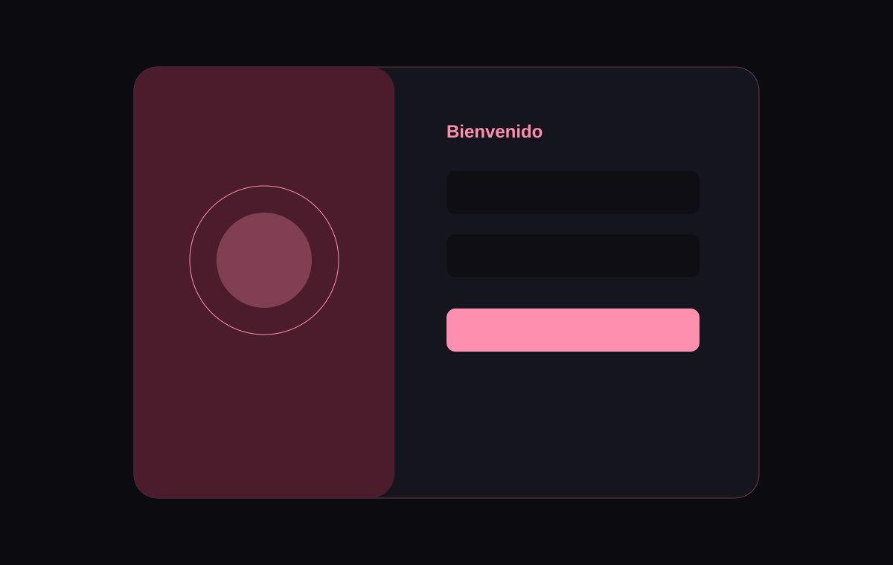

# Animated Login Panel

Panel compacto de acceso y registro con una pequeña cuadrilla animada que reacciona a cada paso del formulario.

## Características

- Login y registro en tabs accesibles.
- Validación frontend con errores asociados a cada campo.
- Un mensajero entrega el correo mientras el usuario escribe.
- Un guardián se cubre los ojos al escribir la contraseña y mira al mostrarla.
- Celebración conjunta con salto y confeti al completar el formulario.

## Demo en vivo

[login.ntdesweb.dev](https://login.ntdesweb.dev/)

## Más demos de efectos

- [Floating Navbar](https://navbar.ntdesweb.dev/)
- [Spotlight Card](https://spotlight.ntdesweb.dev/)
- [3D Product Card](https://card3d.ntdesweb.dev/)

## Instalación

Clona el repositorio, entra en `animated-login-panel` y abre `index.html`.

## Estructura del proyecto

Formularios y personajes en `index.html`, animaciones y estados visuales en `style.css`, e interacción y validación en `script.js`.

## Cómo personalizarlo

Adapta los campos, mensajes de validación y tokens de color; conecta un backend solo tras añadir seguridad real.

## Accesibilidad

Tabs operables con flechas, etiquetas nativas, `aria-invalid`, errores enlazados y foco en el primer error.

## Rendimiento

Sin dependencias, solicitudes de red ni almacenamiento; los personajes están construidos con HTML y CSS y respetan `prefers-reduced-motion`.

## Licencia y créditos

[MIT](LICENSE). Creado por [Nacho Torres](https://github.com/NachoTorresRD) para [NTDESWEB](https://www.ntdesweb.com) con [NT-SKILL SUPREME](https://github.com/NachoTorresRD/nt-skill-supreme).

[Ver en GitHub](https://github.com/NachoTorresRD/animated-login-panel) · [Trabajar con NTDESWEB](https://www.ntdesweb.com)
